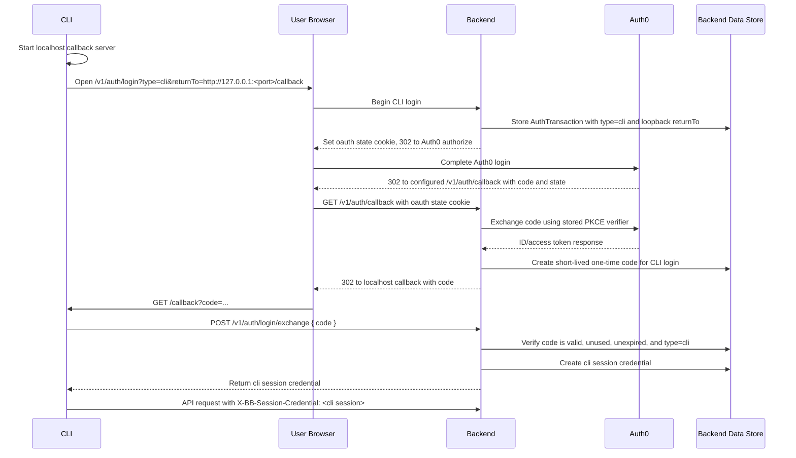

# BuilderLab Auth Flow

This is the intended browser-mediated CLI login flow. Web and CLI can use the same backend Auth0 login path, but the resulting credentials are typed and presented differently.

Security constraints:

- Web sessions are returned as secure cookies and accepted only as cookies.
- CLI sessions are returned by the exchange endpoint and accepted only via the `X-BB-Session-Credential` header. This is a backend wire-protocol name and is not changed by the BuilderLab product rename.
- Durable session credentials are never placed in redirect URLs.
- The localhost redirect carries only a short-lived, single-use exchange code.
- CLI `returnTo` targets must be loopback URLs.
